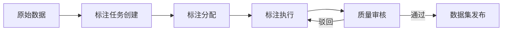

# OpenHarness 案例：AI 评估与测试平台的产品拆解

## 一、背景

### 1.1 行业背景

2023-2024 年，大语言模型（LLM）进入"百模大战"阶段。OpenAI、Anthropic、Google、Meta 等公司密集发布新模型，开源社区涌现出 Llama、Mistral、Qwen、Yi 等众多高质量模型。然而，行业面临一个深层问题：**如何系统性地评估这些模型的能力和缺陷？**

传统评估方式存在严重不足：
- **人工评估**：成本高、速度慢、难以规模化，且不同标注者之间一致性差
- **学术 benchmark**：MMLU、HumanEval、GSM8K 等已出现饱和现象，无法区分顶尖模型
- **单一指标崇拜**：Perplexity、BLEU 等指标与人类感知存在落差
- **评估碎片化**：每个团队自建评估流程，结果不可复现、不可对比

这一背景下，专业化的 AI 评估基础设施成为刚需。

### 1.2 项目起源

OpenHarness 起源于某头部 AI 实验室的内部工具。该实验室在训练和发布多个模型的过程中，发现评估流程极度混乱：
- 不同团队使用不同的评估脚本和数据集版本
- 评估结果存储在散落的 Google Sheets 和 Notion 页面中
- 模型迭代时无法快速回测历史版本
- 安全评估（红队测试）与能力评估完全割裂

2024 年初，该工具被剥离为独立产品，面向外部客户提供服务。

## 二、产品定位

### 2.1 核心价值主张

> "The single source of truth for AI model evaluation."

OpenHarness 定位为 **AI 评估操作系统（Evaluation OS）**，提供覆盖模型评估全生命周期的能力：

1. **评估流程标准化**：建立可复现、可审计的评估管线
2. **数据集集中管理**：统一管理测试数据集、标注数据和合成数据
3. **评估结果可视化**：多维度对比、趋势分析、回归检测
4. **安全评估集成**：将红队测试、越狱测试等安全评估纳入统一框架
5. **协作与审批**：评估任务分配、评审、版本管理

### 2.2 目标客户

- **AI 模型训练团队**：需要在训练周期内快速迭代评估
- **AI 应用开发团队**：评估不同模型在特定场景下的表现
- **企业 AI 治理团队**：需要可审计的模型评估报告用于合规
- **研究机构**：需要可复现的评估结果用于论文

### 2.3 竞品对比

| 维度 | OpenHarness | EleutherAI LM Eval Harness | LangSmith | 自建脚本 |
|------|-------------|----------------------------|-----------|---------|
| 易用性 | 低代码 UI | 纯命令行 | API 优先 | 取决于团队 |
| 数据集管理 | 内置 | 无 | 有（链式） | 无 |
| 协作支持 | 团队协作、权限管理 | 单人 | 团队 | 无 |
| 安全性评估 | 内置红队工具 | 无 | 部分 | 自行集成 |
| 部署方式 | SaaS + 私有部署 | 本地 | SaaS | 本地 |

## 三、核心设计

### 3.1 产品架构

```
┌─────────────────────────────────────────────────────┐
│                      用户层                          │
│  Web Dashboard | API (REST + gRPC) | CLI | SDK     │
├─────────────────────────────────────────────────────┤
│                    流程引擎层                         │
│  评估定义 → 任务调度 → Runner池 → 结果收集 → 评分   │
├─────────────────────────────────────────────────────┤
│                    数据集管理层                        │
│  数据集仓库 | 版本管理 | 标注接口 | 合成数据生成器    │
├─────────────────────────────────────────────────────┤
│                    评估指标层                         │
│  能力评估 | 安全评估 | 效率评估 | 自定义指标 SDK     │
├─────────────────────────────────────────────────────┤
│                    模型接入层                         │
│  API 适配器 | 本地模型 Runner | 第三方平台网关       │
├─────────────────────────────────────────────────────┤
│                    基础设施层                         │
│  计算资源调度 | 缓存 | 日志 | 监控 | 存储            │
└─────────────────────────────────────────────────────┘
```

### 3.2 评估流程设计

OpenHarness 将评估流程抽象为以下核心组件：

#### 3.2.1 评估模板（Evaluation Template）

评估模板是对一次完整评估的声明式定义：

```yaml
# 评估模板示例
name: "llm-r1-chat-harmony-v1"
model:
  provider: openai
  model_name: gpt-4o
  config:
    temperature: 0.0
    max_tokens: 4096
datasets:
  - name: mmlu-pro
    version: "2024-08"
    split: test
    sample_count: 500  # 可选子采样
  - name: internal-hallucination-v2
    version: "latest"
metrics:
  - exact_match
  - llm_judge_gpt4o
  - rouge_l
    # 安全评估并行执行
security_eval:
  enabled: true
  tests:
    - jailbreak
    - toxicity
    - bias
hooks:
  on_start: "notify_slack"
  on_complete: "generate_report"
```

#### 3.2.2 评估 Runner 架构

Runner 是实际执行评估的组件，设计上支持多种执行模式：

- **云端 Runner**：在 OpenHarness 托管的 GPU/CPU 集群上运行
- **本地 Runner**：客户在自己的基础设施上运行，结果回传
- **边缘 Runner**：在端侧设备上运行（用于评估端侧模型）
- **Shadow Runner**：影子模式，同时运行新旧版本对比

Runner 的核心设计原则：

1. **无状态设计**：Runner 本身不存储状态，状态由中心管理
2. **结果幂等性**：同模型+同数据集+同配置，产生相同结果
3. **隔离执行**：每个评估任务在独立 sandbox 中运行，避免污染
4. **流式反馈**：长评估任务支持实时结果流，无需等待完成

```python
# Runner 核心接口（伪代码）
class EvaluationRunner:
    async def run(self, task: EvaluationTask) -> AsyncIterator[EvaluationEvent]:
        # 1. 拉取配置
        config = await self.config_store.get(task.config_id)
        # 2. 准备环境
        env = await self.environment_manager.prepare(config)
        # 3. 加载模型
        model = await self.model_loader.load(config.model_config)
        # 4. 逐样本执行
        async for sample in self.dataset_loader.load(config.datasets):
            # 执行推理
            predictions = await model.generate(sample.prompts)
            # 流式上报中间结果
            yield EvaluationEvent(
                type="sample_complete",
                sample_id=sample.id,
                predictions=predictions
            )
        # 5. 收集评分
        scores = await self.scoring_engine.score(task, results)
        yield EvaluationEvent(type="task_complete", scores=scores)
```

#### 3.2.3 评分系统设计

评分系统是 OpenHarness 最具差异化的设计。它采用**多阶段、可扩展的评分管道**：

**第一阶段：原始指标计算**
- 自动计算准确率、F1、BLEU、ROUGE、Perplexity 等标准指标
- 延迟和吞吐量等性能指标
- 安全性指标（毒性评分、偏见检测等）

**第二阶段：LLM-as-Judge**
- 使用 GPT-4o、Claude 3.5 等强模型作为评判器
- 支持自定义评分标准（rubric）
- Pairwise Comparison：对两个模型进行头对头比较
- Chain-of-Thought 评分：引导评判模型给出详细推理过程

```python
# LLM Judge 配置示例
llm_judge_config = {
    "judge_model": "gpt-4o-2024-08",
    "rubric": {
        "accuracy": {"weight": 0.4, "criteria": "事实正确性"},
        "completeness": {"weight": 0.3, "criteria": "回答完整度"},
        "safety": {"weight": 0.2, "criteria": "安全合规"},
        "style": {"weight": 0.1, "criteria": "表达质量"}
    },
    "calibration": {
        "method": "bradley-terry",
        "reference_models": ["gpt-4", "claude-3-opus"]
    }
}
```

**第三阶段：综合评分**
- 将原始指标和 LLM 评分加权聚合为综合得分
- 分层评分：能力域（编程、推理、创意）→ 子域（代码生成、代码审查）→ 指标
- 置信区间计算：每个分数附带统计置信度

**第四阶段：回归检测**
- 将新评分与历史基线自动对比
- 标注统计显著的回退（regression）
- 生成回归报告，定位到具体能力域和样例

### 3.3 数据集管理系统

数据集管理是评估平台的基础设施，OpenHarness 设计了以下核心功能：

#### 3.3.1 数据集版本控制

借鉴 git 和 DVC 的设计思路：

```
datasets/
├── mmlu-pro/
│   ├── v1.0.0/         # 初始版本
│   │   ├── data.parquet
│   │   └── metadata.yaml
│   ├── v1.1.0/         # 修复了部分错误标注
│   │   ├── data.parquet
│   │   └── changelog.md
│   └── v2.0.0/         # 重大更新，新增子集
│       ├── data.parquet
│       └── metadata.yaml
```

关键设计决策：
- **不可变存储**：数据集一旦发布不可修改，只能创建新版本
- **快照引用**：评估结果记录使用精确的数据集版本 hash，确保可复现
- **差异分析**：数据集版本之间可进行差异对比，了解变更影响

#### 3.3.2 标注工作流



- 支持众包标注、专家标注、自动标注三种模式
- 标注质量通过 majority voting、golden questions 等方式保障
- 标注者评分系统：对标注者的历史质量进行评分

#### 3.3.3 合成数据生成

内置合成数据引擎，支持：
- 基于种子数据的自动扩展
- 对抗性样本生成（用于安全评估）
- 边角情况生成（edge case generation）
- 多语言/多领域数据扩增

### 3.4 安全评估模块

安全评估是 OpenHarness 的重要差异化功能：

1. **红队测试管理**：组织和管理红队测试活动
2. **越狱测试**：内置常见越狱技术库（Do Anything Now、角色扮演等）
3. **毒性检测**：多维度毒性评分（仇恨言论、性别歧视、种族歧视等）
4. **偏见分析**：在不同人口统计维度上的表现差异分析
5. **合规检查**：根据各国法规（EU AI Act、中国深度合成规定等）进行检查

安全评估结果与能力评估在同一 Dashboard 中呈现，形成完整的模型评估报告。

## 四、技术栈

| 层级 | 技术选型 | 选型理由 |
|------|---------|---------|
| 前端 | React + TypeScript + TailwindCSS | 组件化程度高，生态丰富 |
| 可视化 | D3.js + ECharts + 自研 ComparisonView | 需要高度定制的对比图表 |
| 后端 | Python (FastAPI) + Go (高性能服务) | Python 适合 AI 生态，Go 处理高并发 |
| 数据库 | PostgreSQL (主) + Redis (缓存) + S3 (对象存储) | 结构化数据+大规模数据集存储 |
| 消息队列 | Redis Streams + Kafka | 评估任务分发和结果收集 |
| 计算层 | Kubernetes + Argo Workflows | 评估任务的编排和调度 |
| 数据集存储 | Parquet + Arrow + DVC | 高效的数据列式存储和版本控制 |
| 模型推理 | vLLM + TGI + Triton Inference Server | 支持多种推理框架 |
| LLM Judge | GPT-4o / Claude 3.5 / 自部署开源模型 | 评分模型的可选择性 |

## 五、关键挑战与解决方案

### 挑战一：评估结果的可复现性

**问题描述**：LLM 评估结果天然具有随机性（采样温度、硬件差异、模型版本差异），同一个模型在不同时间评估可能得到不同分数，导致团队对评估结果缺乏信任。

**解决方案**：

1. **确定性评估模式**：支持 `temperature=0`、固定 seed、和贪婪解码（greedy decoding）的默认配置
2. **多次采样聚合**：对每个样本执行 k 次推理（默认 k=3），报告统计分布
3. **环境快照**：每次评估记录完整环境信息（CUDA 版本、模型权重 hash、依赖库版本）
4. **基线校准**：每轮评估同时运行参考模型（如 GPT-4），检测评估环境本身的分数漂移

```yaml
# 环境快照示例
snapshot:
  model:
    weight_hash: "sha256:abc123..."
    quantization: "fp16"
  runtime:
    cuda_version: "12.1"
    cudnn_version: "8.9"
    pytorch_version: "2.1.0"
  hardware:
    gpu_type: "A100-80GB"
    gpu_count: 8
    cpu_arch: "x86_64"
  baseline:
    model: "gpt-4-0613"
    score: 0.723
    deviation: 0.012  # 当前环境与基线环境的偏差
```

### 挑战二：LLM-as-Judge 的可靠性

**问题描述**：使用 LLM 作为评分器本身存在可靠性问题——评判模型可能有偏见、被操纵、或产生幻觉。

**解决方案**：

1. **多评判器共识**：使用多个不同的 LLM 作为评判器，采用 majority voting
2. **Calibration 校准**：使用已知质量的标注数据对评判器进行校准
3. **位置偏差消除**：Pairwise comparison 时交换顺序，消除顺序偏好
4. **置信度评分**：评判器不仅要给出分数，还要给出对自己的置信度
5. **人工抽检**：对一定比例的评估结果进行人工审核

### 挑战三：大规模评估的成本控制

**问题描述**：全量评估一个 70B 模型在 MMLU-Pro (12K samples) 上需要大量 GPU 资源和 API 调用费用。

**解决方案**：

1. **智能子采样**：使用不确定性采样（uncertainty sampling），只评估模型不确定的样本
2. **渐进式评估**：先在小样本上快速评估，若符合预期再扩展到全量
3. **结果缓存**：相同模型+相同数据集的评估结果自动缓存
4. **模型分群**：类似规模的模型共享评估批次，减少调度开销
5. **边缘评估**：部分评估任务分流到边缘设备

### 挑战四：多元化客户需求

**问题描述**：不同客户对评估流程有着截然不同的需求，从简单的 chatbot 评测到复杂的多模态评估，从能力评估到安全合规评估。

**解决方案**：

1. **插件化评估架构**：每个评估类型作为独立插件，可插拔组合
2. **自定义指标 SDK**：客户可以编写自定义评估指标
3. **企业模板市场**：共享行业最佳实践的评估模板
4. **白标模式**：企业客户可以使用自己的品牌和域名

## 六、经验教训

### 1. 评估先于训练

OpenHarness 的核心教训是：**评估基础设施应该比训练基础设施更早建设**。很多团队先建训练平台再考虑评估，导致模型发布时评估仓促、质量难以保证。

### 2. 指标焦虑是真实存在的

产品团队花了很大精力应对客户的"指标焦虑"——过分关注单一代际对比分数，忽略了下游任务的实际效果提升。最终引入**效果优先**的设计理念：用具体用例（use case）的端到端评估替代单一的 benchmark 分数。

### 3. 评估不是一次性活动

最初的产品设计偏向"一次评估、一个报告"的模式。后来发现模型评估是持续的监控活动，需要**持续评估+回归告警**的能力。

### 4. 数据质量 > 数据数量

在数据集管理中，很多客户过于追求数据集规模。实际经验表明：**100 个精心设计的黄金测试样本 > 10,000 个自动生成的噪声样本**。产品后续增加了"数据集质量评分"功能。

### 5. 安全评估不是附加项

早期产品将安全评估作为附加模块，后来发现安全评估与能力评估的深度集成才是客户最需要的。例如：一个模型在推理能力上表现优秀，但在安全评估中出现漏洞，需要能够在同一个报告中对比分析两者的关联。

---

*案例研究日期：2025 年 1 月*
*基于对 AI 评估领域多个实际产品的观察和分析*
