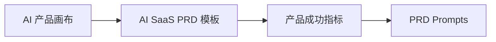
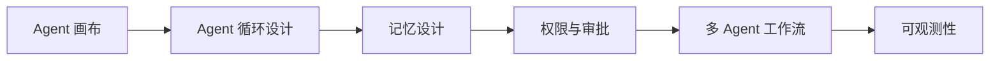
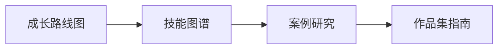

# 🚀 AI PM Playbook — 快速导航

> 选择你的入口，直奔主题。

---

## 🆕 新手入门

如果你是 AI PM 新手，推荐按这个顺序阅读：

```
01-产品框架 → 02-PRD 模板 → 07-Prompts → 03-案例研究
       ↓
06-职业发展 ← 05-Agent 设计 ← 04-评估体系
```

### 第一步：理解产品框架
- [AI 产品画布](/guide/01-framework/ai-product-canvas) — 建立共识框架
- [Agent 产品画布](/guide/01-framework/agent-product-canvas) — 理解 Agent 产品特性

### 第二步：实战 PRD
- 选择对应的 [PRD 模板](/guide/02-prd/ai-saas-prd-template)
- 配合 [PRD Prompts](/guide/07-prompts/prd-prompts) 提升效率

### 第三步：看案例、学评估
- 研究 [案例拆解](/guide/03-cases/appsignal-case-study)
- 建立 [评估体系](/guide/04-evaluation/agent-evaluation-metrics)

---

## 🎯 按场景导航

| 场景 | 推荐文档 |
|------|---------|
| 🧠 设计 AI Agent | [Agent 画布](/guide/01-framework/agent-product-canvas) → [Agent 循环](/guide/05-agent-design/agent-loop) → [记忆设计](/guide/05-agent-design/memory-design) |
| ✍️ 写一份 AI SaaS PRD | [AI SaaS PRD 模板](/guide/02-prd/ai-saas-prd-template) + [PRD Prompts](/guide/07-prompts/prd-prompts) |
| 🔍 设计 RAG 系统 | [RAG 画布](/guide/01-framework/rag-product-canvas) → [RAG PRD 模板](/guide/02-prd/rag-prd-template) |
| 📊 评估 Agent 表现 | [Agent 评估指标](/guide/04-evaluation/agent-evaluation-metrics) + [评估 Prompts](/guide/07-prompts/evaluation-prompts) |
| 🏢 设计多 Agent 系统 | [多 Agent 工作流](/guide/05-agent-design/multi-agent-workflow) → [可观测性](/guide/05-agent-design/observability) |
| 🎯 规划 AI PM 职业 | [成长路线图](/guide/06-career/ai-pm-roadmap) → [技能图谱](/guide/06-career/ai-pm-skill-map) → [作品集](/guide/06-career/portfolio-building-guide) |

---

## 📚 按角色推荐

### 如果你是 AI SaaS 产品经理


### 如果你是 AI Agent 产品经理


### 如果你想转型 AI PM


---

## 📖 完整索引

查看 **[INDEX 总索引](/guide/index)** 获取全部 29 个文档的详细信息。
