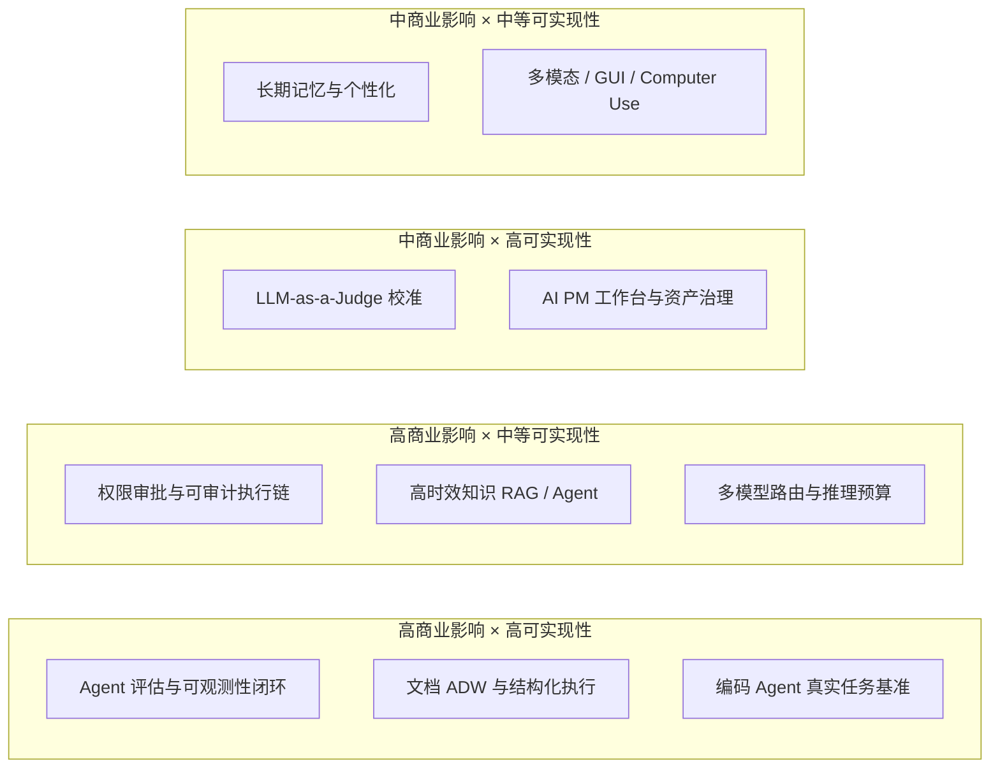
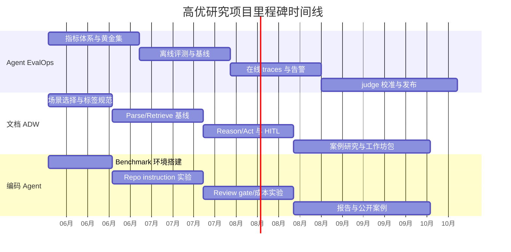
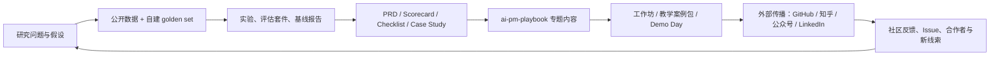

# AI 产品经理深度研究方向与可落地项目分析报告

> **本文是 ai-pm-playbook 研究系列的开篇。** 通过对行业趋势、企业需求和现有 Benchmark 的系统梳理，识别出 10 个值得 AI PM 投入的研究方向，按"商业影响 × 可实现性"分级，并为三个 P0 方向提供详细的项目计划与里程碑。

近两年，AI 产品的竞争重心已经从"模型更强"转向"系统更可靠"。宏观上，Stanford《AI Index 2025》显示，2024 年已有 78% 的组织在使用 AI，生成式 AI 私人投资达 339 亿美元；中国信通院则将 2025 年概括为 AI 从"有能力"走向"有用处"，智能体正成为重要应用形态。

企业侧的真实信号也很一致：OpenAI 报告显示，企业每组织 API 推理 token 消耗同比增长 320%，客服、编码与 agentic workflow automation 已成为主要增长场景；Microsoft 2025 Work Trend Index 则显示，81% 的领导者预计未来 12–18 个月内 agent 将中度或深度进入企业 AI 战略。

因此，AI 产品经理最值得投入的研究，不是再造一个聊天框，而是围绕**评估闭环、文档工作流、编码工作流、权限审计与成本控制**建立一套可验证、可复用、可审计的产品资产。以下建议默认团队与预算"无特定限制"，但优先采用开源与最小可行团队路径。

## 趋势综述

近两年的核心变化可以概括为四条：其一，组织正把 AI 从个人助手升级为多步工作流与数字劳动力；其二，产品架构从"单轮生成"转向"检索、工具、记忆、评估、审批"组合式系统；其三，真实世界 benchmark 正揭示静态基准的乐观偏差；其四，生产化瓶颈已经从"能不能做"转向"能否稳定、可解释、可审计地做"。

| 主题 | 对 AI PM 的含义 | 代表论文/报告 | 实践案例 |
|---|---|---|---|
| 企业采用从试点走向流程重构 | 立项标准要从 demo 效果升级为 ROI、throughput、time-to-resolution | *Artificial Intelligence Index Report 2025*，arXiv:2504.07139；OpenAI《The State of Enterprise AI 2025》 | Microsoft《Work Trend Index 2025》：81% 领导者预计 12–18 个月内将 agent 纳入 AI 战略，46% 公司已用 agent 全自动化部分流程。 |
| 架构从聊天转向 agentic systems | PM 需要设计工作流、工具边界、审批点，而不只是 prompt | Anthropic《Building Effective Agents》：先用简单可组合模式，只有在需要时再引入 agents。 | LlamaIndex 的 ADW 提出 Parse→Retrieve→Reason→Act，是"chat with docs"之后的企业参考架构。 |
| 评估范式变难但更关键 | KPI 必须覆盖任务成功、成本、时延、人工接管与安全 | *Survey on Evaluation of LLM-based Agents*，arXiv:2503.16416；HAL 强调 cost-aware、第三方标准化评测。 | LangChain《State of Agent Engineering》：57.3% 已生产化，质量是首要瓶颈；89% 已做观测，52.4% 做离线 eval。 |
| 静态 benchmark 不足以代表真实世界 | 产品研究必须做"动态、持续更新"的内部任务集 | CRAG 显示简单 RAG 仅将准确率提升到 44%，业界方案无幻觉正确率也仅 63%；SWE-bench-Live 显示最佳 resolved rate 只有 19.25%。 | GitHub Copilot cloud agent 已把"研究仓库→建分支→修改→跑测试→开 PR"做成可审查流水线。 |
| 高风险专业场景强调可追溯与权威内容 | 高价值 AI 产品不是"会说"，而是"可核验地完成工作" | Agent-SafetyBench，arXiv:2412.14470；NIST AI 600-1 GenAI Profile。 | Thomson Reuters CoCounsel Legal 通过权威内容、可追溯引用与不使用客户数据训练第三方模型，定义"fiduciary-grade"工作标准。 |
| GUI / computer use 正从研究走向产品 | PM 需前置设计权限、注入攻击、人工确认 | OpenAI CUA 在 OSWorld / WebArena / WebVoyager 上取得 38.1% / 58.1% / 87%，Anthropic 同时强调 prompt injection 与 present-day harms。 | GitHub、Claude、Operator 一类产品都在把"自然语言→真实操作"做成新入口。 |

## 研究方向地图

优先级建议按"商业影响 × 可实现性"划分：P0 为立即立项，P1 为并行孵化，P2 为探索储备。P0 方向之所以优先，是因为它们同时满足"已有明确企业需求"与"已有公开 benchmark / 开源工具 / 可量化 KPI"。

## 深度研究方向清单

| 方向 | 问题陈述 | 研究/商业价值 | 主要挑战 | 关键研究问题 | 可用数据/资源 | 优先级与预期成果 |
|---|---|---|---|---|---|---|
| Agent 评估与可观测性闭环 | 如何把"感觉能用"转成稳定 scorecard？ | 直接决定上线、回归、采购与成本控制 | 多步、非确定性、跨工具失败 | 任务成功、tool success、groundedness、人工接管如何统一？ | GAIA、τ-bench、HAL、Langfuse/MLflow traces | **P0**；产出：指标树、golden set、eval harness、观测 dashboard |
| 文档 ADW 与结构化执行 | 如何从"问文档"升级到"处理文档工作流"？ | 合同、发票、合规、审计场景 ROI 明确 | 文档解析、表格/布局、规则约束、系统写回 | 何时 RAG 足够，何时需要 Parse→Retrieve→Reason→Act？ | CRAG、LlamaIndex ADW、Milvus/pgvector | **P0**；产出：参考架构、PRD 模板、案例包 |
| 编码 Agent 真实任务基准 | Coding agent 在真实仓库里到底能完成什么？ | 开发者工具 PM、研发提效、内部工程助手 | 静态 benchmark 过拟合、仓库差异大 | repo instruction、memory、review policy 对结果影响多大？ | SWE-bench Verified / Live、Multi-SWE-bench、OpenHands | **P0**；产出：repo benchmark、评测报告、案例研究 |
| 权限审批与可审计执行链 | 让 agent 真正"做事"时，什么操作必须经过人？ | 高风险行业上线前置条件 | 工具滥用、误操作、注入攻击 | 如何定义 action policy、审批阈值、回滚与责任边界？ | Anthropic computer use、EU AI Act、CAC 办法 | **P1**；产出：审批矩阵、审计日志规范、风险 PRD |
| 高时效知识 RAG / Agent | 面向新闻、市场、法规等动态知识，如何降低"旧知识 + 新幻觉"？ | 搜索、研究、风控、投研产品价值高 | 时效性、权威源选择、检索漂移 | 动态索引、web fallback、source weighting 如何设计？ | CRAG、MCP、OpenAI connectors | **P1**；产出：动态知识路由方案、评测集 |
| 多模型路由与推理预算 | 哪些任务该给大模型，哪些交给小模型？ | 直接影响毛利和时延 | 质量—速度—成本三角 | 如何按任务难度、风险等级、语言类型路由？ | Qwen3、DeepSeek-R1、GLM-5；Anthropic routing 模式 | **P1**；产出：routing policy、成本模拟器 |
| LLM-as-a-Judge 校准 | 自动评审能否替代大量人工 review？ | 规模化评估与内容审核必需 | judge 偏差、稳定性、难题失真 | judge 与人工一致性如何校准？ | JudgeBench、DeepEval、OpenCompass/FlagEval | **P1**；产出：judge rubric、校准集 |
| 长期记忆与个性化 | 记忆如何提升长期任务完成率而不放大漂移？ | 个人助手、销售助手、研发 copilot 都需要 | 记忆过载、陈旧、冲突 | 语义记忆、情节记忆、程序化记忆如何组合？ | Memory survey、A-Mem、长上下文评测 | **P1**；产出：memory design guide、实验脚本 |
| 多模态 / GUI / Computer Use | 何时该走浏览器/GUI，何时该走 API？ | 新入口价值大，但风险高 | 屏幕理解脆弱、速度慢、注入多 | GUI-agent 与 API-agent 的任务边界在哪里？ | CUA、WebArena、Anthropic computer use | **P2**；产出：场景选择框架、risk checklist |
| AI PM 工作台与资产治理 | 如何让 PM 从 PRD 到实验到上线形成"可复用资产链"？ | 直接服务 ai-pm-playbook 的品牌化与产品化 | 提示词、评估集、案例分散 | 什么资产应版本化、什么指标应进 release gate？ | OpenAI Evals、Langfuse prompts、MLflow traces | **P1**；产出：研究模板、PRD-to-eval 工作流 |

## 高优项目计划

### Agent EvalOps 研究计划

| 项目要素 | 方案 |
|---|---|
| 目标 | 建立一套适用于知识问答、工作流 agent、工具 agent 的统一评估与观测框架 |
| 假设 | 引入"离线 golden set + 在线 traces + 成本/时延门槛 + LLM-as-judge 校准"后，可显著降低回归风险并提高上线决策质量。方法论参考 Anthropic 的"先简单、可测再加复杂"、HAL 的 cost-aware 思路与 EDDOps。 |
| 方法论 | 定义指标树 → 采集 150–300 条黄金任务 → 建离线 eval → 接 Langfuse/MLflow tracing → 建线上告警与抽样复评 |
| 数据需求 | GAIA、τ-bench、CRAG 子集 + 自建业务任务集。 |
| 验证指标 | task success、groundedness、tool-call success、human override rate、p95 latency、cost per successful task |
| 里程碑 | 第一个月完成 taxonomy 与数据 schema；第二个月完成 baseline；第三个月接入线上 traces；第四个月做 judge 校准；第五到六个月发布 scorecard 与案例包 |
| 所需产出 | 指标树文档、eval harness、trace schema、PRD、benchmark 报告、playbook 章节 |

### 文档 ADW 研究计划

| 项目要素 | 方案 |
|---|---|
| 目标 | 在合同审阅或发票/政策文档场景中，对比"naive RAG"与"ADW"在正确率、可追溯性、自动执行率上的差异 |
| 假设 | 对复杂文档流程，Parse→Retrieve→Reason→Act + typed output + HITL 将明显优于纯聊天式 RAG。 |
| 方法论 | 选择两个文档密集场景；建立 lossless parse、hybrid search、结构化输出、系统写回与审批节点；做 A/B 实验 |
| 数据需求 | 公开 PDF 文档 + 自建 200 条任务与金标；向量检索采用 Milvus 或 pgvector |
| 验证指标 | extraction F1、retrieval recall@k、grounded answer rate、action precision、人工复核时间、单位任务成本 |
| 里程碑 | 第一个月定场景与评测集；第二个月完成 parse/retrieve baseline；第三个月加入 action connector；第四个月做 HITL 和审计日志；第五个月发布案例研究 |
| 所需产出 | ADW 参考架构、PRD 模板、评估集、示例代码、案例包、工作坊实验手册 |

### 编码 Agent 研究计划

| 项目要素 | 方案 |
|---|---|
| 目标 | 构建"公开 benchmark + 自仓库 issue + repo instructions"的混合评测包，量化编码 agent 的真实边界 |
| 假设 | 相比只换更强模型，仓库级指令、测试策略与 review gate 对 resolved rate 的提升更稳定；同时，静态 benchmark 会高估真实表现。 |
| 方法论 | 以 OpenHands 为主框架，分别测试不同模型、不同 repo instructions、不同 review gate；将公开基准与真实 issue 分开汇报 |
| 数据需求 | SWE-bench Verified mini、SWE-bench-Live lite、Multi-SWE-bench，以及 ai-pm-playbook 或相关仓库 issue 集 |
| 验证指标 | resolved rate、patch apply rate、test pass rate、median time to merge、review accept rate、成本/PR |
| 里程碑 | 第一个月搭环境与 benchmark；第二个月整理 repo instructions；第三个月跑基线与 ablation；第四个月引入安全/审查 gate；第五到六个月沉淀案例与 SOP |
| 所需产出 | coding-agent benchmark pack、repo instruction 模板、实验报告、案例研究、培训 slide |

项目时间线建议如下。该时间线按 2026 年 6 月启动设计，覆盖 5–6 个月，适合最小 3–5 人研究小组。

## 工具链与开源资源

| 类别 | 资源 | 用途 | 优点 | 局限 |
|---|---|---|---|---|
| 开源模型 | Qwen3 | 中文、多语、推理/agent 主基线 | Apache 2.0、119 语种、兼顾 thinking 与非 thinking | 自托管与调优门槛较高 |
| 开源模型 | DeepSeek-R1 | 推理与代码基线 | RL 驱动推理能力强，社区生态活跃 | 企业级治理与可控性要靠外部栈补齐 |
| 开源模型 | GLM-5 / GLM-4.5 | agentic engineering、中文与代码任务对照 | 明确面向 agent / coding，适合中国场景研究 | 生态成熟度仍在追赶 |
| Agent 编排 | LangGraph | 状态机、HITL、长期任务 | durable execution、可控性强 | 上手比高层封装更重 |
| Agent / RAG 编排 | LlamaIndex Workflows | 文档 agent、事件驱动工作流 | 对企业文档流很友好，ADW 经验丰富 | 对复杂工程规范需自定义较多 |
| Agent / RAG 编排 | Haystack | 可控 pipeline、agentic RAG | 确定性强，适合从 RAG 平滑升级 | 灵活 agent 形态不如图式编排直观 |
| 编码 Agent | OpenHands | 软件工程 agent 实验平台 | 支持 CLI、浏览器、评测与沙箱 | 资源消耗高，真实仓库调参与安全成本高 |
| 检索与索引 | Milvus / pgvector | RAG 向量检索与混合搜索基础层 | Milvus 适合规模化，pgvector 适合"直接在 Postgres 上起步" | 前者偏专用，后者在超大规模上受限 |
| 通用评估 | Ragas / DeepEval / OpenAI Evals | RAG、agent、提示词与回归测试 | 快速搭建评价闭环，适合 CI/CD | judge 偏差与指标漂移需校准 |
| 基准与榜单 | HAL / OpenCompass / FlagEval | 跨 benchmark、中文/多模态、成本感知评测 | 适合做"研究资产"与对外榜单 | 与真实业务场景仍有域差 |
| 观测与监控 | Langfuse / Phoenix / MLflow / OpenTelemetry | tracing、实验跟踪、在线评估、标准化 telemetry | 开放、易集成、便于构建审计链 | 需要自己定义业务指标与采样策略 |
| 安全与红队 | Promptfoo / Agent-SafetyBench | 注入、越权、泄漏、RAG 文档外泄测试 | 能把安全研究纳入发布流程 | 不能替代人工审计与制度设计 |
| 协议层 | MCP | 统一把模型接到工具与数据源 | 生态增长快，便于构建可复用连接层 | 权限与授权设计必须前置 |

## 推广与落地建议

建议把研究成果直接沉淀为 `ai-pm-playbook` 的"三层资产"：**方法层**做框架与模板，**实验层**做基准与评测套件，**传播层**做案例与教学包。这样仓库既是知识库，也是产品化 demo 与 lead magnet。前两层服务可信度，第三层服务传播与转化。

落地形态建议如下：

| 形态 | 建议内容 | 渠道与样式 | 建议 KPI |
|---|---|---|---|
| Playbook 专题 | `agent-eval/`、`adw/`、`coding-agent-bench/` 三个专题；每个专题含框架、模板、案例 | GitHub README + docs site；强调可复制模板 | stars、forks、独立访客、issue 数 |
| 教学/工作坊 | 半天《Agent 评估实战》、半天《文档 ADW 工作坊》、半天《Coding Agent Benchmark Lab》 | 直播、企业内训、训练营 | 报名数、完课率、NPS、复购线索 |
| 案例包 | Copilot / CoCounsel / Finance Agents 三个 case，配 slides、PRD、指标卡 | 公众号深文、知乎长文、Slide 分享 | 下载量、收藏率、咨询转化 |
| 对外传播 | 做"图表 + 基线 + checklist"内容，而非泛泛观点 | 小红书/即刻发图解，知乎/公众号发长文，LinkedIn 发英文摘要 | CTR、收藏率、订阅数、外链点击 |

## 风险与合规清单

NIST 的 GenAI Profile 将治理、内容来源、预部署测试和事件披露列为核心考虑；欧盟 AI Act 要求高风险场景具备高质量数据、日志、文档、人类监督、鲁棒性与网络安全；中国《生成式人工智能服务管理暂行办法》则明确了合法数据来源、个人信息保护、生成内容标识、违法内容处置、投诉举报与分类分级监管。对 AI PM 而言，最有效的方法不是"列原则"，而是把原则变成 release gate。

| 风险面 | 关键要求 | 最小缓解动作 |
|---|---|---|
| 隐私与个资 | 不得收集非必要个人信息，输入与使用记录需受保护。 | □ 数据分级 □ PII 脱敏 □ retention policy □ 访问审计 |
| 数据来源与版权 | 训练/检索数据应具合法来源，GPAI 还面临透明度与版权义务。 | □ source registry □ 内容来源摘要 □ 合同条款审查 |
| 偏见与歧视 | 需减少歧视性结果，高风险系统要求高质量数据。 | □ 分群评测 □ 反事实样本 □ 人工复核高风险决定 |
| 幻觉与错误决策 | CRAG、Agent-SafetyBench 都显示可靠性远未达生产理想。 | □ groundedness eval □ source citation □ human override |
| 工具滥用与 prompt injection | computer-use 场景对注入与误操作更敏感。 | □ tool allowlist □ 权限最小化 □ 沙箱 □ 手工批准写操作 |
| 审计路径 | 高风险系统需日志、文档、可追溯性。 | □ trace id □ action log □ eval card □ incident runbook |
| 透明度与内容标识 | 欧盟与中国都要求透明与标识。 | □ AI 标识 □ chatbot disclosure □ 深度合成标注 |
| 投诉与事件响应 | 需要投诉入口、处置流程与事件披露。 | □ 举报通道 □ 升级 SLA □ 红队复盘 □ 版本回滚 |

## 一周内启动清单

- 选定三个 P0 方向中的**一个主线 + 一个副线**，并在 `ai-pm-playbook` 新建 `research/` 目录，放入研究问题、假设、KPI 与时间表模板。
- 用公开 benchmark 与手工标注，先做出 **50 条黄金任务集**；没有黄金集，就不要开始做复杂 agent。
- 搭最小研究栈：**Qwen3 或 DeepSeek-R1 + LangGraph + Langfuse + Ragas + Promptfoo**，优先打通"生成—评估—观测—红队"闭环。
- 选择一个文档流程和一个编码流程，各做一个 **baseline demo**：前者用 naive RAG，后者用 OpenHands；把结果写成第一版对比报告。
- **对外发布一篇"研究路线图"文章**和一个 GitHub Issue Roadmap，明确征集：数据集、案例、评测脚本、真实业务任务。

---

*本文是 ai-pm-playbook 研究系列的第一篇。后续将陆续发布各方向的详细研究计划、实验报告与案例研究。*
