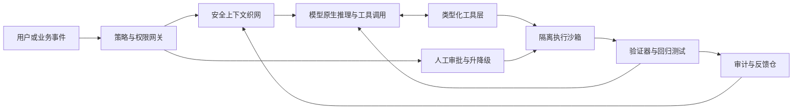

# 大模型与 Harness 的未来轨迹

> **2026-05 维护版**：本文讨论 BigModel 与 BigHarness 的关系，提出三层 harness 分类框架，并给出面向 AI PM、Agent 平台设计者和 AI 基础设施创业者的产品判断。本文涉及较多快速变化的 benchmark、协议和厂商实践，结论应按季度复核。

---

## 执行摘要

这场争论真正的答案，不是 **BigModel** 或 **BigHarness** 谁“吃掉一切”，而是：**不同层的 harness 会被模型以不同速度吞并，最终留下来的价值主要集中在执行可信度、企业上下文与持续评估闭环**。

模型正在吸收大量原本靠提示工程、任务分解和手写编排完成的能力：更长上下文、更强推理、更稳定工具调用、多模态理解、computer use、agent-native API 都在让“认知型 harness”变薄。但一旦问题进入真实组织环境，外部系统仍然不可替代：权限、审批、沙箱、预算、审计、回放、数据驻留、持续评估和事故响应不会因为模型更强而消失。

更准确地说，未来三到五年的趋势更可能是：

```text
认知型 harness 变薄
交互型 harness 局部内生化
生产型 harness 外部化，并成为主要护城河
```

因此，最优架构不是“更厚的编排”或“完全裸奔的模型”，而是：

```text
Model-native runtime
× Secure Context Fabric
× Verifiable Execution
× Continuous Evals
```

---

## 1. 概念边界与三层 Harness 分类

本文将 **harness** 定义为：

> 位于模型与环境之间，把上下文、工具、执行约束、反馈与治理组织成可运行系统的 agent 运行时。

它不等于某个 prompt，也不等于某个框架。它包括 prompt、工具、memory、middleware、sandbox、policy、eval、trace、approval、billing、runtime 等多个层面。

| 层级 | 核心问题 | 典型组件 | 主要失效模式 | 中期趋势判断 |
|------|----------|----------|--------------|--------------|
| 认知型 harness | 模型该想什么、先做什么、何时回看 | 系统提示、任务分解、路由、反思、RAG、记忆、查询改写 | 规划混乱、遗漏约束、上下文过载 | 最容易被更强模型和 test-time compute 吞并 |
| 交互型 harness | 模型如何把意图可靠表达成动作 | 工具 schema、函数调用、编辑格式、GUI / 终端适配、参数约束 | diff 失败、工具错配、GUI 脆弱、无限重试 | 会被部分内生化，但高质量 ACI 仍有价值 |
| 生产型 harness | 系统如何在真实组织里安全、稳定、可审计地运行 | 身份、权限、审批、审计、trace、回放、沙箱、预算、SLA、eval | 泄露、越权、成本失控、不可回放、线上退化 | 最不可能被模型内生化，最可能形成护城河 |

---

## 2. 模型进步如何改变 Harness

| 模型进步方向 | 对认知型 harness | 对交互型 harness | 对生产型 harness |
|--------------|------------------|------------------|------------------|
| 更强基座模型 | 压缩手写 prompt 链和分解套路 | 工具选择更稳 | 不替代权限、审计、预算 |
| 推理 RL / test-time compute | 内生化 plan / reflect / replan | 提升多步修复 | 增加对评估和控制面的要求 |
| 原生 tool use | 让简单 router 变薄 | 仍依赖 schema 设计和参数约束 | 仍需外部策略执行 |
| 多模态 / computer use | 吸收部分 UI 感知能力 | 降低无 API 场景的自动化门槛 | 更需要沙箱和审批 |
| 长上下文 / 记忆 | 减少摘要和压缩套路 | 更好消费外部状态 | 权限、鲜度、脱敏、provenance 更重要 |
| 模型原生 runtime | 提升端到端体验 | 厂商 runtime 更强 | 企业仍需要 control plane |

关键判断：**模型越强，越能吃掉“怎样想”；越接近“怎样安全地做”，外部系统越重要。**

---

## 3. 实证证据如何裁决争论

最值得看的不是单个观点，而是不同 benchmark 和产品实践在什么条件下支持 BigModel，什么条件下支持 BigHarness。

| 证据 | 设计重点 | 结论方向 |
|------|----------|----------|
| SWE-Atlas | 真实代码库任务、原生 scaffold 与通用 harness 对比 | 支持 BigHarness：环境和交互形态会改变表现 |
| Terminal-Bench | 终端长程任务、模型与 agent 对比 | 支持 BigModel：模型跃迁是强变量，但 scaffold 仍重要 |
| Agentic Harness Engineering | 固定基座模型，自动进化 harness | 支持 BigHarness：工具、middleware、memory 可带来显著增益 |
| 编辑工具格式研究 | 不换模型，仅改变编辑格式 | 支持交互型 harness：动作表达本身是性能边界 |
| Cursor 工程实践 | fast apply、Bugbot、long-running coding agent | 支持产品化 harness：runtime + eval loop 可变成商业资产 |
| AI Agent Index | 观察已部署 agent 的透明度与安全评估 | 支持生产型 harness：安全、eval、透明度仍不足 |

因此，更准确的裁决是：**模型与 harness 不是一条轴上的替代关系，而是乘法关系**。

```text
任务效果 ≈ 模型能力 × 上下文质量 × 动作接口 × 执行治理 × 评估反馈
```

在“表征瓶颈”处，交互型 harness 常常带来比换一代模型还大的收益；在“可靠性瓶颈”处，生产型 harness 甚至是唯一可用的增益来源；只有在“纯认知瓶颈”处，模型升级才最像压倒性变量。

---

## 4. 标准化与护城河

MCP、A2A、AGENTS.md、OpenAPI、JSON Schema、Structured Outputs 等标准会降低连接和工具接入成本。但标准化主要发生在线缆层，不会自动创造高质量上下文，也不会自动保证可信执行。

| 资产类型 | 可被标准化程度 | 护城河判断 |
|----------|----------------|------------|
| 通用 prompt 包装 | 高 | 弱 |
| 通用 agent UI | 高 | 弱 |
| 通用连接器目录 | 很高 | 中偏弱 |
| AGENTS.md 模板 | 高 | 中偏弱 |
| 私有上下文织网 | 低 | 强 |
| 权限、审批、审计系统 | 低 | 很强 |
| 线上 trace 和失败样例 | 很低 | 很强 |
| 私有 eval 数据集 | 很低 | 很强 |
| 深嵌业务工作流的分发位置 | 中 | 强 |

关键判断：**协议解决连接问题，不能替代治理问题。连接不是可信执行。**

---

## 5. 更优的混合架构

默认推荐架构：



核心原则：

1. 让模型承担理解、规划、选择、局部修复；
2. 让外部系统承担权限、上下文治理、执行隔离、审计和评估；
3. 把 compute plane 和 control plane 分开；
4. 把工具 schema、权限和审批视为产品设计，而不是工程细节；
5. 用线上 trace 和失败样例建立持续评估飞轮。

### 五种可落地方案

| 架构方案 | 适用场景 | 必要组件 |
|----------|----------|----------|
| 模型原生运行时 | 研发、知识工作、轻量自动化 | agent-native API、内置工具、基础沙箱 |
| 安全上下文织网 | 企业知识、跨系统工作流 | RAG、知识图谱、ACL、provenance、freshness |
| 可验证执行闭环 | 金融、法务、医疗、代码发布 | plan-execute-verify、测试、trace、审批 |
| 神经—符号双控制器 | 强规则、强合规场景 | LLM planner、policy engine、typed tools |
| 边缘个性化 + 云验证 | 隐私敏感、强个性化助手 | 端侧记忆、小模型、云侧验证和审计 |

---

## 6. 建议优先做的实验

| 实验 | 要验证的命题 | 建议指标 |
|------|--------------|----------|
| 同模型多编辑格式 A/B | 交互型 harness 是否比换模型更值钱 | 成功率、重试次数、人工修复率 |
| 原生 scaffold vs 通用 scaffold | 原生运行时是否改变探索质量 | exploration 次数、执行率、pass@1 |
| 上下文质量分层实验 | 企业上下文资产是不是护城河 | 正确率、越权率、澄清次数 |
| 策略外置 vs 模型内约束 | 生产型 harness 是否降低事故率 | 越权率、泄露率、误报率 |
| 单 Agent vs 多 Agent | 多 Agent 何时值得 | 成功率、延迟、成本、错误放大倍数 |

---

## 7. 对创业公司和企业的建议

- **先按三层拆问题，再决定投入点。** 如果失败在动作表达，优先改交互层；如果失败在越权、回归、不可审计，优先改生产层。
- **把 compute plane 与 control plane 分开。** 模型可以换，权限、预算、审批、审计不能跟着模型漂移。
- **尽快建立类型化工具契约。** 至少做到 JSON Schema、参数约束、最小权限和白名单动作。
- **把私有上下文做成产品层，而不是 prompt 层。** 清洗、权限、鲜度、provenance 和语义索引都应进入可治理资产库。
- **持续评测要前置。** 用任务级 eval、轨迹级 eval 和线上 trace 形成闭环。
- **标准化要拥抱，但不要把标准当护城河。** MCP、A2A、AGENTS.md 会降低互联成本，真正差异在 context、trust、distribution。
- **多代理不是默认答案。** 只有当任务可并行、边界清楚、工具密度可控时才值得。
- **高风险场景从可验证动作切入。** 先可证明、可回放、可签名，再逐步扩大自治范围。

---

## 8. 本文边界

1. 公开 benchmark 仍偏 coding / knowledge work，对线下运营、客服、供应链、财务等任务的外推有限；
2. 很多厂商只公开结果，不公开 runtime 细节和失败轨迹；
3. 资本市场估值和媒体报道只能作为商业态度旁证，不能直接当作技术结论；
4. 本文引用的模型、产品、benchmark 更新很快，应按季度复核。

---

## 9. 参考来源

以下来源可用于支撑本文的主要判断，并建议后续维护时优先复核：

| 来源 | 用途 |
|------|------|
| OpenAI — Harness engineering: leveraging Codex in an agent-first world | agent-first 工程、harness 与控制系统 |
| OpenAI Agents SDK / Responses API 文档 | model-native runtime、工具调用、沙箱和 agent primitives |
| Anthropic — Building effective agents | workflows、agents、ACI、工具设计 |
| Anthropic — Model Context Protocol | MCP 标准和工具连接生态 |
| Google Agent2Agent / A2A Protocol | Agent 间通信和协作标准 |
| AGENTS.md 项目 | 项目级 agent 指令约定 |
| Agentic Harness Engineering paper | 固定模型下 harness 改进的实证证据 |
| Scale AI — SWE-Atlas | 真实代码库任务和 scaffold 对表现的影响 |
| Terminal-Bench / Terminal-Bench 2.0 | 终端长程任务和模型/agent 能力比较 |
| METR — Measuring AI Ability to Complete Long Tasks | AI 可完成任务时长的能力外推 |
| Stanford AI Index | 产业级 AI 能力、benchmark、采用趋势 |
| MIT AI Agent Index | 已部署 agent 的透明度、安全和评估实践 |
| Cursor Engineering Blog | fast apply、Bugbot、long-running coding agent 的产品化 harness 实践 |
| OWASP Top 10 for LLM Applications | Prompt 注入、工具安全、供应链和数据泄露风险 |
| NIST AI Risk Management Framework | AI 风险管理和治理框架 |

---

## 10. 维护建议

- 每季度复核 benchmark 名称、分数和模型名；
- 具体数字尽量移动到脚注或参考来源，避免正文长期失效；
- 对未公开细节的厂商案例使用“推断”“媒体报道”“公开工程博客显示”等限定语；
- 若未来模型原生 runtime 明显成熟，应重新评估交互型 harness 的剩余价值；
- 若监管加强，应提高生产型 harness 中审计、审批和合规的权重。

---

*本文是 AI PM Playbook「📡 研究方向」系列的一部分。更多研究文章请访问 [AI PM Playbook](https://github.com/prodthinkpm/ai-pm-playbook)。*
