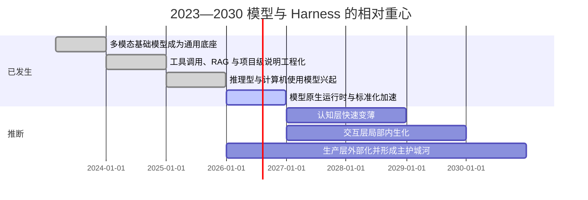
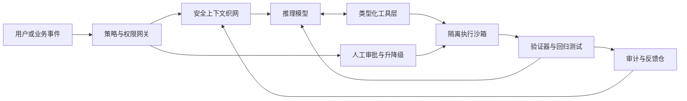

# 大模型与 Harness 的未来轨迹

> 这是「AI PM Playbook」研究方向系列的一篇深度分析。本文系统梳理了 BigModel 与 BigHarness 争论的核心命题，提出三层 harness 分类框架，并结合 SWE-Atlas、Terminal-Bench 2.0、AHE、Pi/oh-my-pi、Cursor 等实证证据给出混合架构建议。适合 AI 产品经理、Agent 平台设计者与 AI 基础设施创业者阅读。

## 执行摘要

这场争论真正的答案，不是 **BigModel** 或 **BigHarness** 谁“吃掉一切”，而是：**不同层的 harness 会被模型以不同速度吞并，最终留下来的价值主要集中在执行可信度、企业上下文与持续评估闭环**。过去三年里，模型已经明显吸收了大量原本靠提示工程和手写编排完成的“认知型 harness”能力：从 GPT-4 的多模态与可预测扩展，到 o1/Claude 3.7/Gemini 2.5 一类“思考型”与工具使用模型，再到 2026 年开始出现的 model-native runtime 与 agent-native API，模型对规划、分解、选择工具、跨多步纠错的内生能力都在快速提升。与此同时，基准和工程案例也表明，**一旦问题落在“动作表达”和“生产治理”边界上，harness 的杠杆仍然非常大**：SWE-Atlas 显示原生 scaffold 让同一模型做更多探索并拿到更高分；AHE 在固定基座模型的前提下把 Terminal-Bench 2 的 pass@1 从 69.7% 提到 77.0%；Pi/oh-my-pi 仅改变编辑工具格式就让 16 个模型里多数显著上升；Cursor 则把“应用编辑、并行代理、代码审查、反馈 hill-climbing”做成了产品能力，而不是单纯的模型接入。

更精确地说，未来三到五年最可能发生的是：**认知型 harness 变薄，交互型 harness 局部内生化，生产型 harness 外部化并成为主要护城河**。开放标准也会加速这一进程：MCP、A2A、AGENTS.md、JSON Schema/Structured Outputs 正在把“连接怎么接、说明怎么写、消息怎么传”变成公共底座，所以“通用套壳”会越来越难形成持久差异；但**企业私有上下文、权限/策略图、隔离执行环境、审计与回放、评测数据集与反馈飞轮**不会被协议免费商品化，反而会因为标准化而更值钱。近期 MCP 生态暴露出的命令注入、认证缺陷与供应链风险，也进一步说明：**协议不是治理，连接不是可信执行**。

因此，潜在的更优解不是“更厚的编排”或“完全裸奔的模型”，而是 **Model-native runtime × Secure Context Fabric × Verifiable Execution × Continuous Evals** 的混合架构：让模型尽量直接承担推理、检索、工具路由和局部修复；让外部系统负责权限、上下文治理、执行隔离、可验证痕迹以及线上反馈闭环。对创业公司而言，最弱的定位是“另一个通用 agent UI”；最强的定位通常是以下三类之一：**私有上下文资产层、可信执行控制层、强分发工作流嵌入层**。

## 概念边界与三层 Harness 分类

本文将 **harness** 操作性地定义为：**位于模型与环境之间、把上下文、工具、执行约束、反馈与治理组织成可运行系统的 agent 运行时**。它不等于某个 prompt，也不等于某个框架；更接近 Anthropic 所说的 augmented LLM / workflows / agents，OpenAI 所说的 harness / model-native runtime，及 AHE 论文里 prompts、tools、middleware、skills、memory、configuration 的总和。需要强调的是，下面的三层分类是本文提出的分析框架，不是业界既有标准，但它能较好解释“哪些部分会被模型吞掉，哪些不会”。

| 层级 | 核心问题 | 典型技术组件 | 主要失效模式 | 中期趋势判断 |
|---|---|---|---|---|
| 认知型 harness | 模型“该想什么、先做什么、何时回看” | 系统提示、AGENTS.md、任务分解、路由、反思/评审循环、RAG、短长期记忆、查询改写、简单 evaluator-optimizer | 规划混乱、遗漏约束、上下文过载、无法回收错误 | 最容易被更强模型与 test-time compute 吞并 |
| 交互型 harness | 模型“如何把意图可靠地表达成动作” | 工具 schema、函数调用、编辑格式、UI/浏览器/终端适配、沙箱 I/O、状态同步、参数约束、动作校验 | diff/编辑失败、工具调用错配、GUI 脆弱、无限重试 | 会被部分内生化，但高质量 ACI 仍是关键差异 |
| 生产型 harness | 系统“如何在真实组织里安全、稳定、可审计地运行” | 身份与权限、策略网关、审批、人机协作、审计日志、追踪、回放、沙箱、隔离、队列、预算、SLA、持续 eval、A/B、回归测试、A2A/MCP 编排 | 泄露、越权、成本失控、不可解释、不可回放、线上退化 | 最不可能被模型内生化，且最可能形成护城河 |

这一分层可从一线实践中得到映射：Anthropic 将 agent 成功的关键归纳为 augmented LLM、workflow、ACI；OpenAI 在 2026 年把“model-native harness+ native sandbox execution”正式产品化；AHE 则把 harness 明确拆成 prompt、工具、middleware、memory 等可编辑面；MCP、A2A 与 AGENTS.md 则把跨系统连接和项目级上下文约定推向标准化。

## 过去三年到未来五年的能力轨迹

过去三年的主线并不是“模型单点变强”，而是 **能力从文本生成，扩展到推理、工具、环境交互，再扩展到 model-native runtime**。2023 年，GPT-4 把多模态与大规模 post-training alignment 带到主流，并展示了跨规模可预测性；2024 年，工具使用与上下文连接开始从框架能力变成平台/协议能力，Anthropic 推出 MCP 与 computer use，OpenAI 推出 o1 这类以大规模强化学习驱动的推理模型；2025 年，Gemini 2.5、Claude 3.7/4、OpenAI CUA/Responses API 把 test-time compute、并行工具、长上下文、GUI 操作和 agent-native primitives 明显向前推了一步；到 2026 年，OpenAI 已经把“更强的 agent loop、原生沙箱、harness 与 compute 分离”写进 Agents SDK 的官方产品语言里。

这个时间线的核心依据有三点。第一，**任务时长能力正在扩张**：METR 在 2025 年提出的“50% 任务完成时间跨度”显示，前沿模型的可完成任务时长自 2019 年以来大致每 7 个月翻倍，并推断若趋势外推，5 年内可自动化相当一部分原本需要人类一个月的软件任务。第二，**真实环境 benchmark 在快速上升**：Terminal-Bench 论文指出，仅 8 个月里，从 Gemini 2.5 Pro 到 GPT 5.2，SOTA 表现几乎翻倍；Stanford AI Index 2026 也把 Terminal-Bench 的真实任务成功率从 2025 年的 20% 提升到 77.3% 作为代表性信号。第三，**更好的模型并不自动意味着更多 agent 就更好**：Google 2026 关于 agent systems scaling 的研究表明，多代理在高度可并行任务上能大幅增益，但在强顺序依赖任务上反而会显著退化，因此未来不是“把更多 orchestration 堆上去”，而是“让架构与任务属性匹配”。

下面这张矩阵更直接回答“模型进步会怎样影响三层 harness”：

| 模型进步方向 | 对认知型 harness 的影响 | 对交互型 harness 的影响 | 对生产型 harness 的影响 |
|---|---|---|---|
| 纯 scaling 与更强基座 | 压缩手工分解、few-shot 模板和 prompt 链的价值 | 让工具选择更稳，但不自动解决动作表达脆弱性 | 几乎不替代权限、审计、预算与 SLA |
| instruction tuning / RLHF | 提升遵循项目说明、AGENTS.md、工具文档的能力 | 降低简单工具 API 的接入成本 | 只能改善“听话”，不能提供治理保证 |
| 推理 RL / test-time compute | 内生化 plan-reflect-replan；减少手写思维脚手架 | 提升连续多步修复与自纠错 | 让系统更强，也提高对评测与控制面的要求 |
| 原生 tool use / function calling | 让小工具集下的 router/orchestrator 变薄 | 强依赖 schema 设计和参数约束质量 | 仍需外部策略执行与动作白名单 |
| 多模态 / computer use | 把部分 UI 感知与操作吸入模型 | 显著降低“没有 API 就不能自动化”的约束 | 更要求隔离 VM、风险分级与人工审批 |
| 长上下文 / RAG / 记忆 | 减少压缩上下文与摘要套路，但放大“上下文质量”差异 | 让模型更好消费外部状态 | 使上下文权限、鲜度、脱敏与 provenance 更重要 |

这张矩阵背后的关键证据包括：GPT-4 的多模态与 post-training alignment；InstructGPT 的 RLHF；o1 的大规模强化学习推理；Gemini 2.5 与 Claude 3.7/4 的 thinking、并行工具、记忆增强；Anthropic 对 tool format/ACI 的系统强调；OpenAI 的 Responses API、computer use 与 model-native harness；以及 RAG 作为“参数记忆+ 外部记忆”的经典路线。整体结论是：**模型越强，越能吃掉“怎样想”；但越接近“怎样安全地做”，外部系统越重要**。

## 实证证据如何裁决争论

最值得看的不是单个观点，而是 **不同 benchmark 在什么条件下支持 BigModel，什么条件下支持 BigHarness**。

| 证据 | 设计重点 | 关键发现 | 对争论的含义 |
|---|---|---|---|
| SWE-Atlas | 284 个真实仓库任务，覆盖 Codebase Q&A、Test Writing、Refactoring | 顶尖系统整体仍多在 40 多分；原生 scaffold 下的 Claude Code / Codex CLI 比同模型 generic harness 做出 1.5x–2x 更多探索、执行与搜索，分数也更高。 | 支持 BigHarness：环境与交互形态直接改变表现 |
| Terminal-Bench 2.0 | 89 个终端长程任务，比较 agent 与模型 | 前沿 agent/模型在论文发布时仍解决不到 65% 任务；作者同时指出“模型选择通常比 agent scaffold 更重要”，并且 8 个月内 SOTA 近乎翻倍。 | 支持 BigModel，但不否认 scaffold 重要性 |
| AHE | 固定基座模型，仅自动进化 harness | 10 轮迭代把 pass@1 从 69.7% 提到 77.0%，超过人写 Codex harness 的 71.9%；增益主要来自工具、middleware、长期记忆，而非 prompt。 | 强力支持 BigHarness，尤其在生产级运行时上 |
| Pi / oh-my-pi | 仅改变编辑工具格式，不换模型不训练 | 16 个模型里多数显著提升；Grok Code Fast 1 从 6.7% 到 68.3%，说明很多“模型差”其实是动作表达差。 | 强力支持交互型 harness 的高杠杆 |
| Cursor | 用专门的 fast-apply 模型、并行代理与评测环路打磨产品 | Cursor 训练专门的 70B apply 模型，默认重写整文件而不是 diff；Bugbot 经过 40 次大实验把 resolution 从 52% 提升到 70% 以上；长程自主编码则从“平级代理抢锁”转向 planner-worker 协作。 | 说明 runtime/harness 可以成为产品与商业资产，而不只是过渡层 |

把这些证据放在一起，争论会变得清晰很多。**BigModel 派在两个条件下通常更对**：一是任务可以用薄 scaffold 表达，二是模型代际差显著大于运行时差。Terminal-Bench 直说“通常模型选择更重要”，Anthropic 在 Claude 3.7 Sonnet 的主结果里也强调了“最小 scaffolding”，只给 bash、文件编辑和 planning tool，让模型在单 session 里自己决定命令与编辑。

但 **BigHarness 派在另外两个条件下更对**：一是任务的瓶颈不在“理解”，而在“可靠表达动作”；二是任务进入真实组织环境，必须处理上下文组织、流程约束、权限规则、回归验证与长程稳定性。SWE-Atlas 证明原生 scaffold 能改变探索行为；AHE 证明固定模型下仍可通过运行时持续增益；Pi 证明编辑接口就是性能边界；Cursor 证明“更好的 apply、更好的 review loop、更好的 worker coordination”可以直接做成产品能力。

因此，更准确的裁决是：**模型与 harness 不是一条轴上的替代关系，而是一个乘法关系**。在“表征瓶颈”处，交互型 harness 常常带来比换一代模型还大的收益；在“可靠性瓶颈”处，生产型 harness 甚至是唯一可用的增益来源；只有在“纯认知瓶颈”处，模型升级才最像压倒性变量。

## 内生化边界、标准化与护城河

未来三到五年，以下判断最稳：**会被内生化的是“智能决策的局部套路”，不会被内生化的是“组织边界上的责任系统”**。例如，任务分解、基本工具路由、轻量记忆摘要、简单的自我修复和一部分 GUI 操作，正在被 reasoning、computer use、long context、tool use 吸收；但权限、审批、身份映射、沙箱、成本预算、审计与回放、线上评估、数据脱敏、合规与 SLA，本质上绑定的是企业状态与责任边界，而不是模型参数。OpenAI 在新版 Agents SDK 里甚至明确把“harness from compute for security, durability, and scale”作为设计方向，这几乎就是对“生产型 harness 不会消失”的官方承认。

标准化正在快速发生，但标准化主要作用在 **线缆层**，而不是 **护城河层**。MCP 把模型与工具/数据源的连接方式标准化；A2A 试图把 agent 之间的协作标准化；AGENTS.md 把项目级指令文件标准化；Structured Outputs / JSON Schema 则把结构化输出与工具契约正规化。它们都会降低集成税、增强模型可替换性、压缩“连接器生意”的超额利润，但不会自动创造高质量上下文，也不会自动保证安全执行。近期 MCP 生态中披露的命令注入、DNS rebinding、缺少认证等问题，恰恰说明“协议统一”与“生产可信”是两回事。

从商业上看，护城河强弱大致可按下面方式排序：

| 资产类型 | 可被标准化程度 | 跨模型可迁移性 | 护城河判断 |
|---|---|---|---|
| 通用 prompt 包装 / 通用 agent UI | 高 | 高 | 弱 |
| 通用 MCP 连接器目录 | 很高 | 高 | 中偏弱 |
| 项目级 AGENTS.md 模板与通用技能包 | 高 | 高 | 中偏弱 |
| 私有上下文织网 | 低 | 高 | 强 |
| 策略图、身份映射、审批与审计系统 | 低 | 很高 | 很强 |
| 线上 trace、失败轨迹、私有 eval 数据集 | 很低 | 高 | 很强 |
| 深嵌业务工作流的分发位置 | 中 | 中 | 强 |

这里最值得强调的是 **私有上下文织网** 与 **评测反馈飞轮**。AI Agent Index 2025 研究 30 个已部署 agent 后发现，大多数开发方在 safety、evaluation 与社会影响上公开信息很少，且只有极少数产品提供 agent-specific safety evaluations；这意味着，真正懂得如何持续测量、定位、修复 agent 失败的团队，天然会比只会“接最强模型”的团队更有复利。Cursor 的 Bugbot 就是一个典型例子：它不是靠一次性 prompt 魔法，而是靠 40 次大实验、AI 驱动指标和多阶段验证把产品性能慢慢 hill-climb 上去。

如果把 Cursor 作为商业案例看，最重要的不是“它是不是自己训练前沿基座模型”，而是它在 **交互层与生产层** 是否拥有可积累的产品资产。官方工程文档显示，Cursor 一方面为文件应用训练专门的 fast-apply 模型并采用 speculative edits，另一方面为长程 coding 设计 planner-worker 协调，为 Bugbot 建立并行审查、验证器和实验迭代系统；这说明市场买单的并不只是“模型 access”，而是“模型+ runtime+ feedback system”。媒体在 2026 年 4 月报道称 Cursor 融资谈判估值约 500 亿美元，这一数字即便未获公司正式公告，也足以说明资本市场正在把 agent runtime 当作平台层资产而非简单 wrapper 估值。

## 更优的混合解法与企业迁移路径

我认为未来最优的默认架构不是“厚框架包住裸模型”，也不是“把一切交给模型”，而是 **模型原生推理与工具调用在内、上下文治理与可信执行在外**。下面这张图给出一个适合大多数企业的默认形态：

这套结构综合了 Anthropic 的 augmented LLM/ACI 思路、OpenAI 的 model-native harness 与 native sandbox、MCP/A2A/AGENTS.md 的标准化连接能力，以及 verifiable execution / formal tool safety 的研究方向。关键原则是：**把模型放在最擅长的“理解—规划—选择”位置，把可信执行与组织控制放在模型外面。**

下面给出五种更具体、可落地的混合方案：

| 架构方案 | 适用场景 | 主要优点 | 主要短板 | 必要组件 | 企业迁移路径 |
|---|---|---|---|---|---|
| 模型原生运行时 | 研发、知识工作、从零开始的新应用 | 上手快，能直接吃到模型升级红利 | 供应商依赖强，生产控制不够深 | agent-native API、内置工具、基础沙箱 | 从单人 copilot / CLI 开始，先跑内部任务 |
| 安全上下文织网 | 文档密集、跨系统知识工作流 | 护城河强，跨模型可迁移 | 前期要清洗语义层与权限层 | RAG、知识图谱/语义层、ACL、freshness/provenance | 先做 1–2 个高价值流程的 context service |
| 可验证执行闭环 | 金融、法务、医疗、代码发布 | 可信、可回放、可审计 | 延迟和工程成本更高 | plan-execute-verify-replan、测试、trace、证明/签名 | 先接入高风险步骤，如发邮件、合并 PR、支付 |
| 神经—符号双控制器 | 强规则、强合规场景 | 把创造性与确定性组合起来 | 规则维护成本高 | LLM planner、symbolic policy engine、typed tools | 先把少量高风险规则从人工 SOP 编码为策略 |
| 边缘个性化+ 云验证 | 隐私敏感、强个性化助手 | 隐私更好，低延迟，粘性更强 | 端侧能力与同步复杂 | on-device memory、小模型、本地上下文、PCC/安全云 | 先把偏好、草稿、历史摘要下沉到端侧 |

其中，“边缘个性化+ 云验证”并非空想。Apple 已把 on-device foundation model 与 Private Cloud Compute 作为体系化路线推出；Google 也在推动 Gemini Nano 的端侧 API。它们意味着未来一部分 **个性化记忆与私密上下文** 可以常驻端侧，而高成本的验证、搜索、审计与长程代理在云侧完成。这会让“用户专属 harness”从 SaaS 配置项变成设备级资产。

要验证本文判断，最值得优先做的不是宏大叙事，而是几组能迅速出结论的实验：

| 近端实验 | 要验证的命题 | 最小设计 | 建议指标 |
|---|---|---|---|
| 同模型多编辑格式 A/B | 交互型 harness 是否比换模型更值钱 | 固定模型，仅切换 patch / rewrite / hash-anchor | 成功率、重试次数、输出 token、人工修复率 |
| 原生 scaffold vs 通用 scaffold | 原生运行时是否改变探索与完成质量 | 同模型同任务，对比 native CLI 与 generic harness | exploration 次数、执行率、最终 pass@1 |
| 上下文质量分层实验 | 企业上下文资产是不是主要护城河 | 原始文档 vs 清洗语义层 vs 带权限标注语义层 | 正确率、越权率、人工澄清次数 |
| 策略外置 vs 模型内约束 | 生产型 harness 能否显著降低事故率 | 同任务，对比“纯提示约束”与“外部策略网关” | 越权动作率、泄露率、阻断误报率 |
| 单代理 vs 多代理按任务属性分流 | 多代理何时值得 | 按 Google 的可并行性/工具密度分桶 | 成功率、延迟、成本、错误放大倍数 |

对创业公司和企业，我建议的动作优先级如下：

- **先按三层拆问题，再决定投入点。** 如果失败主要发生在“不会表达动作”，优先改交互层；如果主要发生在“越权、回归、不可审计”，优先改生产层，而不是继续调 prompt。
- **把 compute plane 与 control plane 分开。** 模型可以换，权限、预算、审批、审计不能跟着模型一起漂移。OpenAI 已明确把 harness 与 compute 分离作为 agent SDK 方向。
- **尽快建立类型化工具契约。** 至少做到 JSON Schema、参数约束、最小权限和白名单动作；工具描述本身要视为 prompt engineering 的一部分。
- **把私有上下文做成产品层，而不是 prompt 层。** 清洗、权限、鲜度、provenance、语义索引、嵌套 AGENTS.md/技能包，都应该进入可治理资产库。
- **持续评测要前置。** 不要等上线后靠事故学习；用任务级 eval、轨迹级 eval 和线上 trace 形成闭环。Anthropic、OpenAI、Cursor 都在这一点上给出了非常一致的工程信号。
- **标准化要拥抱，但不要把标准当护城河。** MCP、A2A、AGENTS.md 会降低互联成本；真正差异要放在 context、trust、distribution。
- **多代理不是默认答案。** 只有当任务可并行、可分解、工具密度可控时才值得；顺序依赖强的任务，多代理可能更差。
- **高风险场景从“可验证动作”切入，而不是从“更自主”切入。** 先让系统可证明、可回放、可签名，再放大自治范围。

本文也有边界。第一，公开 benchmark 仍然偏 coding/knowledge-work，对线下运营、客服、供应链、财务等任务的外推有限。第二，很多厂商只公开结果，不公开 runtime 细节与失败轨迹，AI Agent Index 也明确指出透明度不足。第三，像 Cursor 估值这样的市场信号主要来自媒体报道，应视为“资本市场态度的旁证”，不是技术结论本身。

最后，如果只保留一个总判断，我会写成一句话：**未来的胜负手不在“模型还是 harness”，而在“哪些 harness 功能会被模型内生化，哪些必须作为可信外部系统存在”。认知层会被迅速压缩，交互层会留下一批高杠杆接口设计，生产层将成为最稳的长期价值。**

可优先阅读的来源如下，几乎都能直接支撑本文的主结论：

| 来源 | 为什么优先读 |
|---|---|
| OpenAI《Harness engineering: leveraging Codex in an agent-first world》 | 最直接展示“工程师角色从写代码转向设计环境、反馈环与控制系统” |
| Anthropic《Building effective agents》 | 最清晰的 agent/workflow/ACI 实操框架 |
| AHE 论文《Agentic Harness Engineering》 | 固定模型下 harness 增益的最强学术证据之一 |
| Scale《SWE Atlas》论文与官方博客 | 观察原生 scaffold、探索行为与工程质量差异 |
| 《Terminal-Bench 2.0》论文 | 支持“模型跃迁”与“真实长程任务”的关键证据 |
| Cursor《Editing Files at 1000 Tokens per Second》《Building a better Bugbot》《Scaling long-running autonomous coding》 | 看清 runtime、review loop、并行代理是如何变成产品能力 |
| Stanford AI Index 2025/2026 与 MIT AI Agent Index 2025 | 把微观工程感受放到产业级能力与透明度趋势中理解 |
| METR《Measuring AI Ability to Complete Long Tasks》与 Google《Towards a science of scaling agent systems》 | 一个给出能力外推，一个给出多代理何时有用的结构性结论 |

---

*本文是 AI PM Playbook「📡 研究方向」系列的一部分。更多研究文章请访问 [AI PM Playbook](https://github.com/prodthinkpm/ai-pm-playbook)。*
